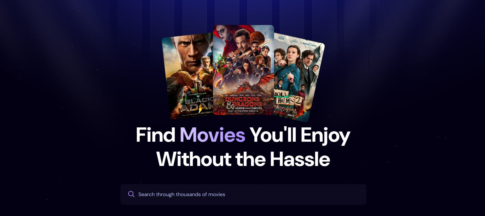

# 🎬 MovieTime
A modern, responsive movie discovery web application built with React and powered by The Movie Database (TMDB). Browse trending movies, search for your favorites, and explore detailed movie information with a sleek, user-friendly interface.

## ✨ Features
- **Trending Movies**: Discover what's popular right now
- **Movie Search**: Find movies by title with instant results
- **Detailed Movie Info**: View comprehensive movie details including ratings, release dates, and descriptions
- **Responsive Design**: Optimized for desktop, tablet, and mobile devices
- **Modern UI**: Clean and intuitive interface with smooth animations
- **Real-time Data**: Up-to-date movie information from TMDB API
  
## 🚀 Live Demo
Check out the live application: [MovieTime](https://movie-time-sigma.vercel.app/)
## 📸 Preview

## 🛠️ Tech Stack
- **Frontend Framework**: React 18
- **Styling**: Tailwind CSS
- **Build Tool**: Vite
- **Database**: Appwrite
- **Movie API**: The Movie Database (TMDB)
- **Deployment**: Vercel
- **State Management**: React Hooks (useState, useEffect)
## 🏗️ Installation & Setup
1. **Clone the repository**
   ```bash
   git clone https://github.com/iamarshalrejith/MovieTime.git
   cd MovieTime
   ```
2. **Install dependencies**
   ```bash
   npm install
   ```
3. **Environment Setup**
   Create a `.env` file in the root directory and add your API keys:
   ```env
   VITE_APPWRITE_PROJECT_ID=your_appwrite_project_id
   VITE_APPWRITE_DATABASE_ID=your_database_id
   VITE_TMDB_API_KEY=your_tmdb_api_key
   ```
4. **Start the development server**
   ```bash
   npm run dev
   ```
5. **Build for production**
   ```bash
   npm run build
   ```
## 📁 Project Structure
```
MovieTime/
├── public/
│   ├── preview.png
│   └── ...
├── src/
│   ├── components/
│   ├── App.jsx
│   ├── main.jsx
│   ├── index.css
│   └── appwrite.js
├── index.html
├── package.json
├── vite.config.js
├── tailwind.config.js
└── README.md
```

## 🔧 Key Components
- **Movie Cards**: Display movie posters, titles, and ratings
- **Search Functionality**: Real-time movie search with debounced input
- **Trending Section**: Showcase popular and trending movies
- **Responsive Grid**: Adaptive layout for different screen sizes
- **Movie Details**: Detailed view with comprehensive movie information
## 🚀 Deployment
The application is deployed on Vercel with automatic deployments from the main branch. Every push to the repository triggers a new deployment.

## 🤝 Contributing
Contributions are welcome! Please feel free to submit a Pull Request. For major changes, please open an issue first to discuss what you would like to change.
1. Fork the repository
2. Create your feature branch (`git checkout -b feature/AmazingFeature`)
3. Commit your changes (`git commit -m 'Add some AmazingFeature'`)
4. Push to the branch (`git push origin feature/AmazingFeature`)
5. Open a Pull Request
   
## 📄 License
This project is open source and available under the [MIT License](LICENSE).
## 🙏 Acknowledgments
- Movie data provided by [The Movie Database (TMDB)](https://www.themoviedb.org/)
- Thanks to [JS Mastery](https://www.jsmastery.io/) for the inspiration and guidance
- Icons and images from various open-source libraries
